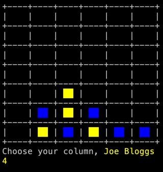

# Quick start

## Prerequisites
- JDK 17+
- Git client

## Run application

1. Clone this repo to your machine:
```shell
git clone https://github.com/habanahaba/legendary-chainsaw.git
```

2. From the repository root, run the following command:
```shell
./gradlew run
```

3. In the opened console window, use numeric input to choose column in every turn.

    
4. At any point, press Q to exit the game.
5. Enjoy the game!